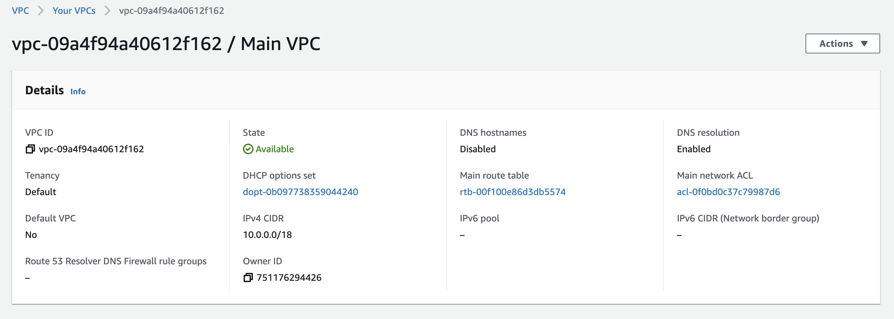
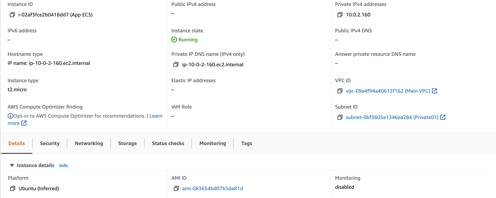

# Deply 9

<h1 align=center>Using Terraform</h1>

### Objectives
Provision cloud infrastructure to build a fully functional VPC.

This deployment was very striaght forward and invovled a lot of looking up each component in the Terraform documentation and understanding the different arguments/attributes. I began by building the VPC and subnets.

### VPC

The important details here was the cidr blocking and making sure the subnets could exist within the vpc's domain. The internal subnets weren't associated with any route tables. The nat gateway was placed into the public subnet. There were little to no issues with this part of the assignment.

### Security Groups

We needed to create three security groups. One for the ALB, one for the EC2, and one for the DB. The ALBsg will allow for outbound traffic to the EC2sg, and the EC2sg will allow for inbound from the ALBsg. When first making these sg's I ran into a `Cycle Error`. The reason for this is that the ALBsg's egress rule referenced the EC2sg, while the EC2sg's ingress rule referenced the ALBsg, creating a unresolvable loops of sorts. One sg couldnt be created without the other existing already.

The workaround here is to create the ALBsg without the egress rule, and then add the egress rule referencing EC2sg with `aws_security_group_rule`.

### Instances

We need to make sure the EC2 is in the private subnet, and that we attach the EC2sg.

The ALB needs to be mapped to both public subnets. Make sure the target groups and listeners are pointing in the right directions.

The DB was more challenging to build. From multi-az, to the engine version, to the subnet group that needs to be created, getting it all right included many terraform apply's.

### Conclusion

The `.tf` files contain the code to spin up a complete VPC and its component infrastructure. Here are some screenshots of the infrastructure in the console.

**VPC**

**Subnets**

**EC2**

**Database**

## Requirements
- [ ] Add all Terraform files to the pull request.
- [ ] Document the process, issues and anything you decided to do differently.
- [ ] Screenshot samples of your infrastucture from AWS and include in your PR.
- [ ] DO NOT upload the `terraform.tfstate` file to the repo (it should be ignored by default)

